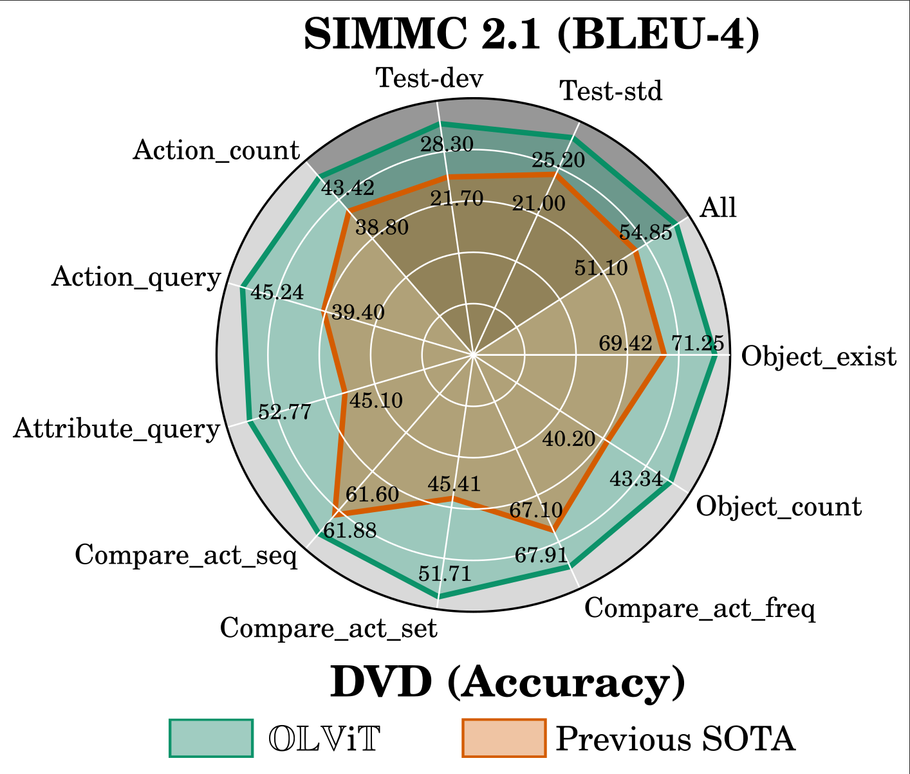
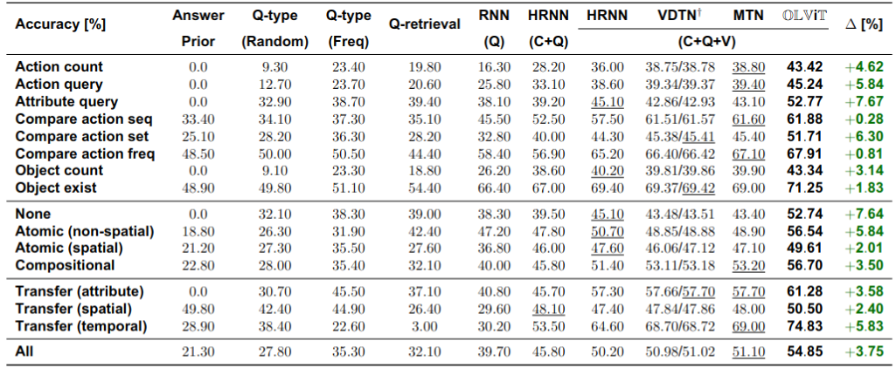

<div align="center">
<h1> OLViT: Multi-Modal State Tracking via Attention-Based Embeddings for Video-Grounded Dialog  </h1>
    
**Anonymous** :ghost: <br>

**Submitted to LREC-COLING 2024** <br>
----------------
<br><br>

</div>

# Table of Contents
* [Setup and Dependencies](#Setup-and-Dependencies)
* [Download Data](#Download-Data)
* [Training](#Training)
* [Testing](#Testing)
* [Results](#Results)
* [Acknowledgements](#Acknowledgements)

# Setup and Dependencies
We implemented our model using Python 3.7, PyTorch 1.11.0 (CUDA 11.3, CuDNN 8.3.2) and PyTorch Lightning. We recommend to setup a virtual environment using Anaconda. <br>
1. Install [git lfs][1] on your system
2. Clone our repository to download a checpint of our best model and our code
   ```shell
   git lfs install
   git clone this_repo.git
   ```
3. Create a conda environment and install dependencies
   ```shell
   conda create -n olvit python=3.7
   conda activate olvit
   conda install pytorch==1.11.0 torchvision==0.12.0 torchaudio==0.11.0 cudatoolkit=11.3 -c pytorch
   pip install pytorch-lightning==1.6.3 
   pip install transformers==4.19.2
   pip install torchtext==0.12.0
   pip install wandb nltk pandas 
    ```
# Download Data
1. [DVD][2] and [SIMMC 2.1][3] data are included in this repository and will be downloaded using git lfs  
2. Setup the data by executing
   ```shell
   chmod u+x setup_data.sh
   ./setup_data.sh
    ```
3. This will unpack all the data necessary in ```data/dvd/``` and ```data/simmc/``` 

# Training
We trained our model on 3 Nvidia Tesla V100-32GB GPUs. The default hyperparameters need to be adjusted if your setup differs from ours.
## DVD
1. Adjust the config file for DVD according to your hardware specifications in ```config/dvd.json```
2. Execute
```shell
CUDA_VISIBLE_DEVICES=0,1,2 python train.py --cfg_path config/dvd.json
```
3. Checkpoints will be saved in ```checkpoints/dvd/```

## SIMMC 2.1
1. Adjust the config file for SIMMC 2.1 according to your hardware specifications in ```config/simmc.json```
2. Execute
```shell
CUDA_VISIBLE_DEVICES=0,1,2 python train.py --cfg_path config/simmc.json
```
3. Checkpoints will be saved in ```checkpoints/simmc/```

# Testing
1. Execute
```shell
CUDA_VISIBLE_DEVICES=0 python test.py --ckpt_path <PATH_TO_TRAINED_MODEL> --cfg_path <PATH_TO_CONFIG_OF_TRAINED_MODEL>
```

# Results
Training using the default config and a similar hardware setup as ours will result in the following performance

## DVD
<br><br>

## SIMMC 2.1
<br><br>

# Acknowledgements
Our work relied on the codebases of [DVD][2] and [SIMMC][3]. Thanks to the authors for sharing their code.


[1]: https://git-lfs.com/
[2]: https://github.com/facebookresearch/DVDialogues/
[3]: https://github.com/facebookresearch/simmc2/
